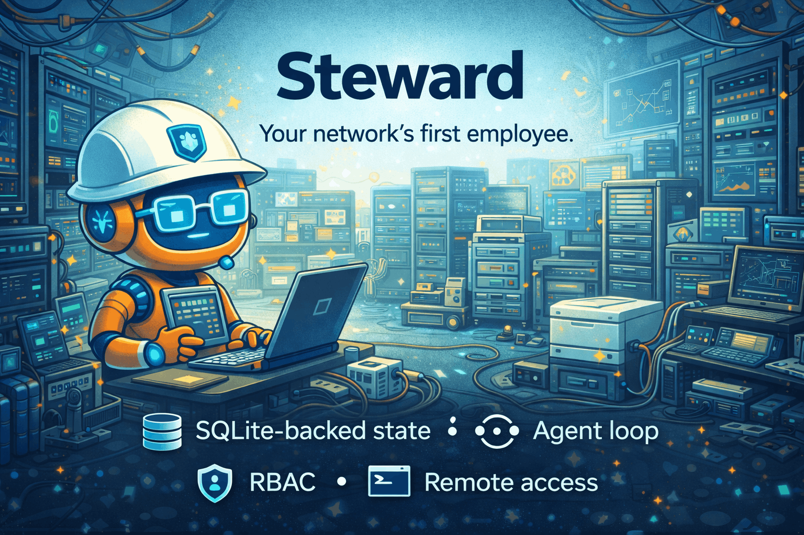
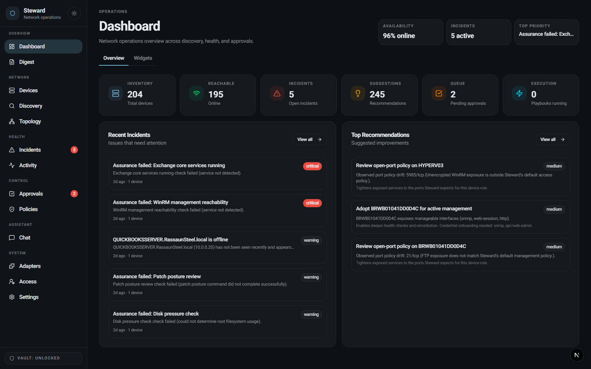
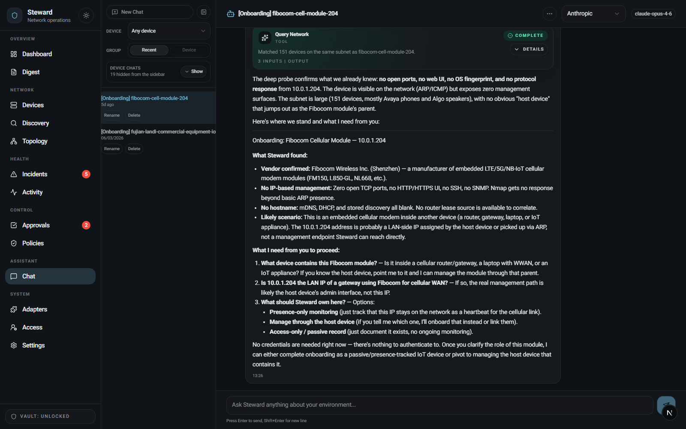
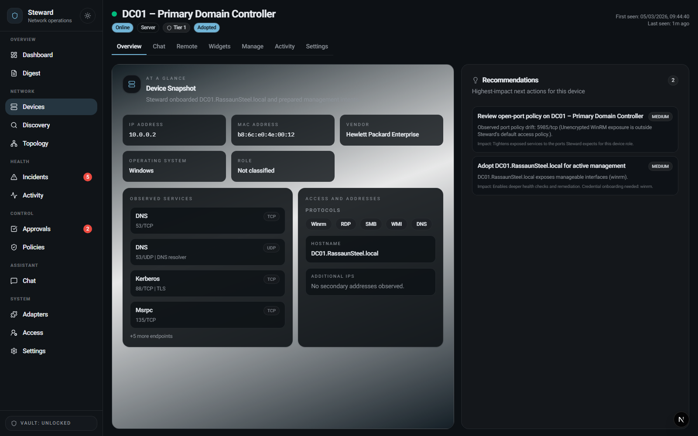
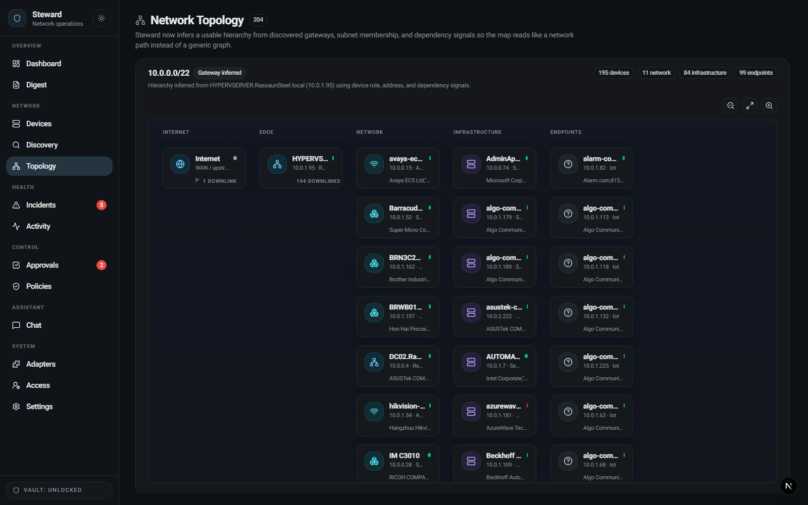

<div align="center">
  
  <h1>Steward</h1>
  <p><strong>Your network's first employee.</strong></p>
  <p>
    <a href="#quickstart"><strong>Quickstart</strong></a>
    |
    <a href="#screenshots"><strong>Screenshots</strong></a>
    |
    <a href="#documentation"><strong>Documentation</strong></a>
    |
    <a href="#what-this-repo-actually-ships"><strong>What This Repo Ships</strong></a>
    |
    <a href="#api-surface"><strong>API Surface</strong></a>
  </p>
  <p>
    
    
    
    
  </p>
</div>

Steward is a self-hosted IT operations control plane for small networks: a local-first system with discovery, persistent state, graph-backed inventory, chat over live infrastructure context, policy-gated remediation, secure credential storage, device onboarding, widgets, automations, and operator access control.

The current repo also includes a first-class autonomy layer:

- `missions` for durable goals Steward owns over time
- `subagents` for domain-specific operational ownership
- `investigations` for persistent follow-up instead of one-shot alerts
- `packs` for installable operational knowledge
- a Telegram-first `gateway` for briefings, approvals, and operator presence
- mission-thread chat sessions that bind Telegram threads, chat history, and mission ownership together

Current release highlights:

- DB-backed configuration with no product env-var drift
- durable job control plane for monitoring, remediation, and notifications
- graph projections with temporal node and edge history
- time-series persistence for latency and assurance evidence
- section-based live state streaming instead of full-state SSE snapshots

## Documentation

- [Architecture](./docs/architecture.md)
- [Operator Guide](./docs/operator-guide.md)
- [Security](./docs/security.md)
- [API Guide](./docs/api.md)
- [Packs SDK](./docs/packs-sdk.md)

## Screenshots
<table>
  <tr>
    <td width="50%">
      
      <p><strong>Inbox and morning briefing</strong><br />Critical issues, approvals, recommendations, and operator context in one surface.</p>
    </td>
    <td width="50%">
      
      <p><strong>Conversation as the interface</strong><br />Ask why the NAS was slow yesterday and get an answer backed by live state.</p>
    </td>
  </tr>
  <tr>
    <td width="50%">
      
      <p><strong>Device detail and management surface</strong><br />Per-device health, credentials, capabilities, autonomy tier, and recent actions.</p>
    </td>
    <td width="50%">
      
      <p><strong>Topology and dependencies</strong><br />Understand blast radius, upstream dependencies, and the shape of the network at a glance.</p>
    </td>
  </tr>
</table>

## What Steward Is

- A Next.js 16 + React 19 application with both operator UI and JSON APIs
- A persistent `discover -> understand -> act -> learn` agent loop with manual and scheduled execution
- SQLite-backed state, audit history, settings history, graph projections, protocol sessions, widget state, dashboard layout state, and device adoption records
- An encrypted vault for device credentials, provider secrets, OAuth tokens, and web research API keys using OS-native key protection plus AES-256-GCM
- Device discovery across passive ARP, mDNS, SSDP, multicast discovery, active nmap sweeps, reverse DNS, packet capture hints, browser observation, and service fingerprinting
- Device classification heuristics that infer type, vendor, OS family, management protocols, and confidence scores
- A graph-backed topology model linking devices, services, workloads, assurances, access methods, profiles, and site/subnet membership
- Incidents, recommendations, approvals, playbook runs, daily digests, and action logs
- A policy engine with autonomy tiers, action classes, maintenance windows, quantitative risk scoring, TTL-based approvals, escalation, rollback hooks, and quarantine on repeated failure
- A broker-first execution layer for SSH, HTTP, WebSocket, MQTT, WinRM, PowerShell over SSH, WMI, SMB, RDP, VNC-backed remote desktop, and local-tool operations
- Device-scoped chat with live context, graph queries, onboarding flows, browser-backed web sessions, remote terminal access, and widget generation
- Adapter management with file-backed and managed adapter packages, manifests, tool skills, runtime config, and adapter-contributed playbooks
- A mission-control layer with DB-backed missions, subagents, investigations, briefings, Telegram gateway bindings, and pack inventory
- Device widgets, widget controls, per-device automations, and dashboard widget pages
- RBAC, local auth bootstrap, session auth, API token auth, OIDC SSO, and LDAP login
- DB-backed runtime, system, auth-token, and auth settings with mutation history and as-of reads

## Core Capabilities

### Discovery and inventory

Steward combines passive and active discovery so it can do more than ping a subnet. The current implementation uses ARP data, mDNS, SSDP, multicast discovery, nmap scans, reverse DNS, packet intel via `tshark`, browser-based observation of web consoles, TLS and HTTP inspection, SSH banner capture, SNMP and DNS probing, WinRM endpoint checks, MQTT broker checks, SMB negotiation, and NetBIOS hints.

Each device record carries services, protocols, evidence, metadata, timestamps, adoption state, and graph relationships. Discovery is not a one-shot import; it is part of the recurring agent loop.

### Operator control plane

The app already exposes real operator surfaces for:

- Dashboard
- Missions
- Subagents
- Packs
- Gateway
- Digest
- Devices
- Discovery
- Topology
- Incidents
- Activity
- Approvals
- Policies
- Chat
- Adapters
- Access control
- Settings

Per-device pages go beyond inventory. They include access methods, stored credentials, adapter/profile binding, workloads, assurances, findings, chat, widgets, automations, remote desktop, and remote terminal access.

### Durable autonomy

Steward now separates long-lived agency from one-shot chat turns.

- `Workloads` and `assurances` remain the concrete device-scoped contracts and checks.
- `Missions` sit above them and represent durable goals such as availability watch, certificate watch, backup hygiene, storage health, WAN guardian, and daily briefing.
- `Subagents` now carry typed scope and autonomy policy: domain, allowed mission kinds, approval mode, channel voice, escalation windows, and autonomy budgets.
- `Subagents` also persist mission-run memory, standing orders, cross-mission delegations, and mission plans so ownership survives across turns and across days.
- `Investigations` persist follow-up across restarts and across days, with stage-based state (`detect -> correlate -> hypothesize -> probe -> decide -> act -> verify -> explain`), evidence, recommended actions, unresolved questions, and step history.
- `Briefings` are stored artifacts, not transient UI strings, and are compiled separately from durable channel delivery jobs.
- `Missions` support `shadowMode` so a domain can stage ownership and briefing behavior before operator-facing delivery or action.
- Chat sessions can now be formally bound to `missionId`, `subagentId`, and `gatewayThreadId`, so Telegram threads and in-app conversations share the same durable mission context.

This cutover is DB-backed and additive. It does not move product behavior into environment variables.

### Safe automation and remediation

Steward does not jump straight from detection to mutation. The repo has a real approval and execution pipeline with policy evaluation, risk scoring, approval TTLs, escalation, safety gates, execution lanes, idempotency keys, verification steps, rollback sequences, and failure quarantine.

Built-in playbooks currently cover:

- systemd, Docker, and Windows service recovery
- TLS certificate renewal
- rsync backup retry
- NAS snapshot verification
- disk cleanup
- configuration backup over SSH or HTTP

### Assistant, remotes, and generated surfaces

The conversational layer runs against live local state, not a static prompt. It can answer from devices, incidents, graph structure, recent changes, and device-scoped context, then route into first-party operations.

The current codebase also includes:

- Browser-backed web sessions for recurring appliance UIs
- In-app remote desktop sessions for RDP and VNC via `guacd`
- A per-device remote terminal that selects SSH, WinRM, or PowerShell-over-SSH based on observed access
- Generated device widgets with first-class controls backed by the operation runtime
- Per-device automations that can run widget controls on manual, interval, or daily schedules

### Extensibility

Steward is already designed to be extended in-repo. Adapters can contribute discovery, enrichment, capability mapping, deterministic profile matching, tool skills, and playbooks. The app includes adapter package CRUD, config editing, tool-skill configuration, and built-in starter adapters for HTTP surfaces, Docker operations, and SNMP-derived network intelligence.

The new pack system broadens that model. Packs can now carry:

- subagents
- mission templates
- workload and assurance templates
- finding templates
- investigation heuristics
- playbooks
- report templates
- briefing templates
- gateway templates
- adapters and tools
- lab fixtures

Managed pack lifecycle is now a first-class API surface:

- manifest validation
- Steward compatibility checks
- signer registry and Ed25519 signature verification for verified packs
- materialized pack resources
- install and upgrade history
- enable / disable / remove flows without touching product env vars

## LLM and Provider Support

The repo supports multiple model backends and local endpoints. Current provider support includes:

- OpenAI
- Anthropic
- Google
- Mistral
- Groq
- xAI
- Cohere
- DeepSeek
- Perplexity
- Fireworks
- Together AI
- OpenRouter
- Ollama
- LM Studio
- Custom OpenAI-compatible endpoints

Web research is also configurable through DB-backed settings and can use Brave scraping, DuckDuckGo scraping, Brave API, Serper, or SerpAPI.

## Quickstart

### Local development

```bash
npm install
npm run dev
```

Open [http://localhost:3010](http://localhost:3010).

First-time flow:

1. Visit `/access` and bootstrap the first account.
2. Configure at least one LLM provider.
3. Run the agent loop from the UI or call `POST /api/agent/run`.
4. Review discovered devices.
5. Add credentials only where Steward should actually manage a device.
6. Tune runtime and system settings from the UI.
7. Configure a Telegram gateway binding if you want chat-native briefings and approvals.

### Docker compose

```bash
docker compose up --build
```

This stack includes:

- Steward on port `3010`
- `guacd` for in-app remote desktop sessions
- Persistent local state mounted at `./.steward`

### Production scripts

macOS / Linux / WSL:

```bash
chmod +x ./scripts/install-prod.sh
chmod +x ./scripts/run-prod.sh
./scripts/install-prod.sh
./scripts/run-prod.sh
```

Windows PowerShell:

```powershell
./scripts/run-prod.ps1
```

## Validation

Before merging or cutting a build, run:

```bash
npm run lint
npm run test
npm run build
```

The repository now includes a GitHub Actions workflow that runs the same `lint -> test -> build` sequence on pushes and pull requests.

Autonomy-specific validation now includes:

- pack signer and verified-pack API coverage
- Telegram gateway threading and inbound dedupe coverage
- mission replay fixtures for WAN, backup, and certificate guardians
- schema migration coverage for chat-thread and pack-signing cutover
- restore-drill coverage for the autonomy schema backup path

## Host tooling

The repo expects real network tooling. The install scripts and postinstall hooks ensure or attempt to install:

- `nmap`
- `tshark`
- SNMP tools
- Playwright browser runtime
- PowerShell
- `guacd` or Docker-based `guacd` for remote desktop features

## State and Security Model

Steward stores local data under `.steward/`:

- `steward_state.db`
- `steward_audit.db`
- `vault.enc.json`
- `vault.key`

Runtime and product settings are persisted in SQLite. Provider metadata is DB-backed, while provider secrets and device credentials are stored in the encrypted vault. API access can be gated by a DB-backed auth token, and operator access can be managed through local users, OIDC, or LDAP.

## Notification MVP

The current public-beta outbound notification surface is intentionally narrow:

- Telegram
- Generic outgoing webhooks

Email, Slack, Teams, SMS, and push delivery are deliberately deferred until after the first public-beta release.

Telegram is now more than a notification sink. Steward includes a Telegram-first gateway with:

- DB-backed gateway bindings
- inbound webhook processing
- inbound update dedupe
- durable thread-to-chat-session binding
- mission, subagent, investigation, and status commands
- natural-language prompts such as "what are you watching", "show open missions", and "why was <device> slow"
- briefing compilation plus durable `channel.delivery` jobs
- durable `approval.followup` reminders when approvals are aging in the queue
- approval and deny commands for pending playbook actions

The dashboard and device contract surface are now mission-aware as well:

- `/` surfaces active missions, active investigations, pending approvals, and recent briefings before lower-level widgets
- device contract pages show mission ownership over committed workloads and assurances
- `/api/autonomy/metrics` and the home dashboard surface queue lag, worker health, mission latency, briefing latency, and channel delivery latency

## API Surface

Core endpoints:

- `GET /api/health`
- `GET /api/state`
- `POST /api/agent/run`
- `POST /api/chat`

Settings:

- `GET/POST /api/settings/runtime`
- `GET/POST /api/settings/system`
- `GET/POST /api/settings/auth-token`
- `GET /api/settings/history?domain=runtime|system|auth`

Inventory and operations:

- `GET/POST /api/devices`
- `GET /api/devices/:id/adoption`
- `GET/POST /api/devices/:id/credentials`
- `GET/POST /api/devices/:id/widgets`
- `GET/POST /api/devices/:id/automations`
- `GET/PATCH /api/incidents`
- `GET /api/approvals`
- `POST /api/approvals/:id`
- `GET/POST /api/playbooks/runs`
- `GET /api/audit-events`
- `GET/POST /api/digest`

Autonomy:

- `GET /api/autonomy/metrics`
- `GET/POST /api/missions`
- `GET/PATCH /api/missions/:id`
- `GET /api/missions/:id/delegations`
- `GET /api/missions/:id/plan`
- `POST /api/missions/:id/run`
- `GET /api/subagents`
- `GET/PATCH /api/subagents/:id`
- `GET/POST /api/subagents/:id/orders`
- `GET /api/investigations`
- `GET/PATCH /api/investigations/:id`
- `GET/POST /api/packs`
- `GET/POST /api/packs/signers`
- `GET/PATCH/DELETE /api/packs/signers/:id`
- `GET/PATCH/DELETE /api/packs/:id`
- `POST /api/packs/:id/toggle`
- `GET /api/devices/:id/autonomy`
- `GET/POST /api/gateway/bindings`
- `GET/PATCH/DELETE /api/gateway/bindings/:id`
- `POST /api/gateway/telegram/:bindingId/webhook`
- `GET/POST /api/briefings`

Identity and providers:

- `GET /api/auth/me`
- `POST /api/auth/bootstrap`
- `POST /api/auth/login`
- `POST /api/auth/logout`
- `GET/POST/PATCH/DELETE /api/auth/users`
- `GET/POST /api/providers`
- `GET /api/providers/models`
- `GET/POST /api/vault`

Remote access:

- `GET/POST /api/remote-desktop/sessions`
- `POST /api/remote-desktop/sessions/:id/viewer-bootstrap`
- `GET/POST /api/devices/:id/remote-terminal`

## Contributing

If you are contributing:

- Keep runtime and product configuration DB-backed
- Prefer deterministic execution paths and auditable state transitions
- Update public docs when product behavior changes

## License

Steward is available under the [MIT License](./LICENSE).
