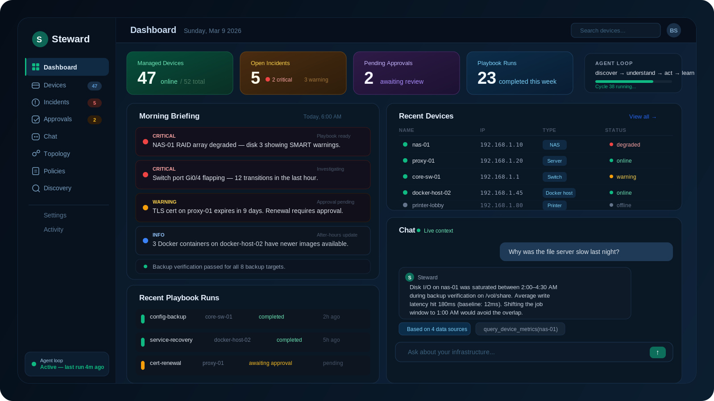
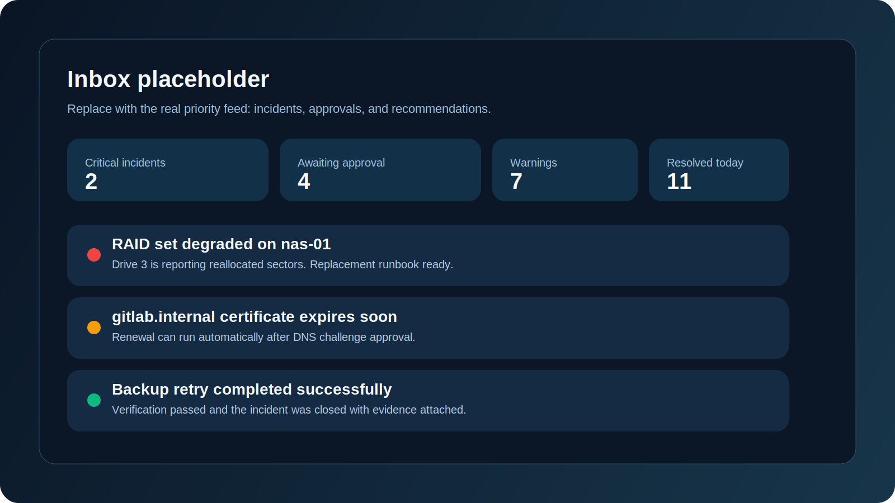
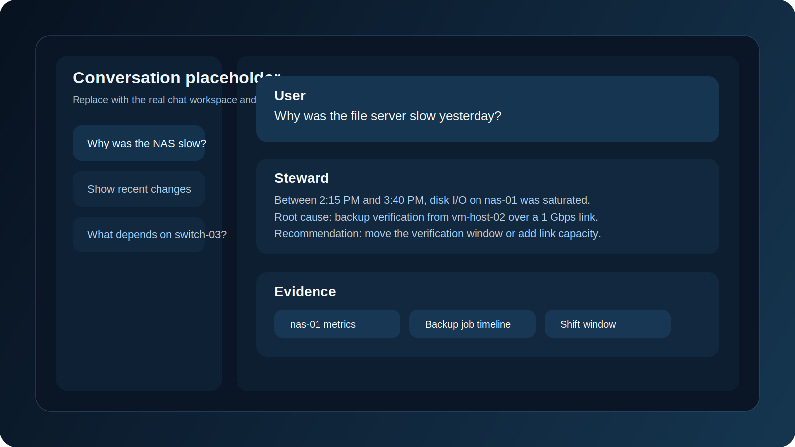
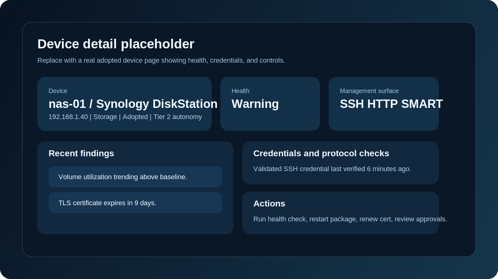
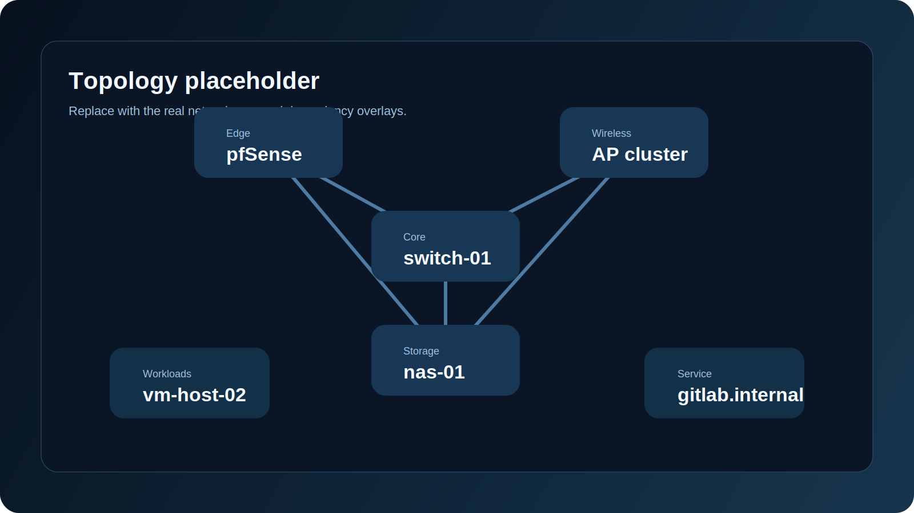

<div align="center">
  
  <h1>Steward</h1>
  <p><strong>Your network's first employee.</strong></p>
  <p>
    Steward is a self-hosted autonomous IT operations agent for the messy real-world networks
    that small teams actually run: servers, switches, NAS boxes, access points, printers,
    Docker hosts, VMs, and the mystery device nobody wants to touch.
  </p>
  <p>
    <a href="#quickstart"><strong>Quickstart</strong></a>
    |
    <a href="#screenshots"><strong>Screenshots</strong></a>
    |
    <a href="#what-exists-today"><strong>What Exists Today</strong></a>
    |
    <a href="#roadmap"><strong>Roadmap</strong></a>
  </p>
  <p>
    
    
    
    
    
  </p>
</div>

Steward is built for the teams that have real infrastructure but no actual IT department. If you are the founder who "handles IT," the office manager who reboots the NAS, or the solo operator with a serious homelab, Steward aims to be the first system that behaves more like an employee than a dashboard.

> Status: this repo already ships a substantial self-hosted control plane with discovery, chat, incidents, approvals, policies, playbooks, vault, and RBAC. It is not yet the full end-state described in the long-term product vision. The current implementation checklist lives in [tasks.md](./tasks.md), and the systems backlog lives in [docs/world-class-system-program.md](./docs/world-class-system-program.md).

## Why this hits differently

Most infrastructure tools stop at "here is a graph" or "here is an alert."
Steward is trying to close the loop:

- Discover what is on the network without installing agents everywhere.
- Explain what changed, what is at risk, and why it matters in plain English.
- Take action through policy-gated playbooks instead of dumping more toil on the operator.
- Build durable institutional memory in local state so the system gets sharper over time.
- Keep configuration in SQLite-backed settings, not a graveyard of environment variables.

## Screenshots

> These are intentional placeholders. Replace the SVGs in `docs/screenshots/` with real captures later and the README layout stays intact.

<table>
  <tr>
    <td width="50%">
      
      <p><strong>Inbox and morning briefing</strong><br />Critical issues, approvals, recommendations, and operator context in one surface.</p>
    </td>
    <td width="50%">
      
      <p><strong>Conversation as the interface</strong><br />Ask why the NAS was slow yesterday and get an answer backed by live state.</p>
    </td>
  </tr>
  <tr>
    <td width="50%">
      
      <p><strong>Device detail and management surface</strong><br />Per-device health, credentials, capabilities, autonomy tier, and recent actions.</p>
    </td>
    <td width="50%">
      
      <p><strong>Topology and dependencies</strong><br />Understand blast radius, upstream dependencies, and the shape of the network at a glance.</p>
    </td>
  </tr>
</table>

## What exists today

### Today, in this repo

- Persistent agent loop: `discover -> understand -> act -> learn`
- Mixed discovery pipeline: ARP, active scan, mDNS, SSDP, and UDP service probes
- Live device, service, and dependency graph
- Incidents, recommendations, approvals, and playbook runs
- Policy engine with action classes, risk scoring, maintenance windows, and rollback gates
- Conversational interface over live inventory and graph data
- Multi-provider LLM support
- Encrypted vault for provider secrets and device credentials
- Local users, RBAC, OIDC SSO, and LDAP auth
- DB-backed runtime, system, and auth-token settings with history

### Where it is headed

- Protocol-native execution brokers across more device families
- Deeper device-specific onboarding and adoption workflows
- Broader deterministic findings across storage, backup, certificates, workloads, and network drift
- Better baselines, anomaly detection, and graph-backed diagnosis
- Notifications, weekly reporting, and multi-site federation

## Quickstart

### Local development

1. Install dependencies:

```bash
npm install
```

`postinstall` bootstraps Playwright's browser runtime and checks required network tools.

2. Start Steward:

```bash
npm run dev
```

3. Open [http://localhost:3010](http://localhost:3010)
4. Open [http://localhost:3010/access](http://localhost:3010/access) to bootstrap the first account and configure auth.
5. Add model providers, credentials, and runtime settings from the UI or API.
6. Steward persists its local state under `.steward/`.

### Docker

```bash
docker build -t steward .
docker run --rm -p 3000:3000 -v "$(pwd)/.steward:/app/.steward" steward
```

Open [http://localhost:3000](http://localhost:3000).

### Production scripts

macOS / Linux / WSL:

```bash
chmod +x ./scripts/install-prod.sh
chmod +x ./scripts/run-prod.sh
./scripts/install-prod.sh
./scripts/run-prod.sh
```

Windows PowerShell:

```powershell
./scripts/run-prod.ps1
```

PM2:

```bash
npm i -g pm2
./scripts/install-prod.sh
npm run build
pm2 start ecosystem.config.cjs
pm2 save
```

Useful commands:

- `pm2 status`
- `pm2 logs steward`
- `pm2 restart steward`
- `pm2 stop steward`

## First 10 minutes

After Steward boots, do these in order:

1. Bootstrap the first account at [http://localhost:3010/access](http://localhost:3010/access) if you are running locally.
2. Add at least one model provider so the conversational layer can answer with live context.
3. Run the agent loop from the UI or call `POST /api/agent/run` to populate the first pass of discovery state.
4. Review discovered devices, incidents, and recommendations before granting deeper credentials.
5. Set an API auth token before exposing the instance outside a trusted local environment.

Enable the API guard token:

```bash
curl -X POST http://localhost:3010/api/settings/auth-token \
  -H 'content-type: application/json' \
  -d '{"token":"replace-with-a-strong-token"}'
```

Then send either:

- `Authorization: Bearer <token>`
- `x-steward-token: <token>`

## No `.env` product config

This repo has a hard rule: runtime product configuration does not live in environment variables.

- Runtime settings are stored in SQLite-backed settings history.
- System settings are stored in SQLite-backed settings history.
- API auth token guard is DB-backed.
- Provider secrets and tokens live in the encrypted vault.

That keeps configuration inspectable, auditable, and queryable over time instead of disappearing into process state.

## How it works

### 1. Discover

Steward starts by listening and scanning. It combines passive signals with active enumeration to find devices, ports, services, and likely management protocols.

### 2. Understand

It classifies devices, builds graph relationships, records evidence, and keeps a living model of what depends on what.

### 3. Act

It creates incidents and recommendations, evaluates policy, and executes playbooks only when allowed by autonomy tier, risk, and safety gates.

### 4. Learn

It stores history, settings, approvals, and observations locally so future explanations and actions have context.

## Architecture snapshot

- Control plane: agent loop, policy engine, playbook runtime, conversation layer, notifications and digest generation
- Data: SQLite-backed state and audit durability, encrypted vault, graph projections
- Access: local auth, RBAC, OIDC, LDAP
- Execution: approvals, risk-scored actions, rollback-aware playbooks
- UX: inbox, topology, device detail, incident timelines, policy UI, chat workspace

## API surface

Core endpoints:

- `GET /api/health`
- `GET /api/state`
- `POST /api/agent/run`
- `POST /api/chat`

Settings:

- `GET/POST /api/settings/runtime`
- `GET/POST /api/settings/system`
- `GET/POST /api/settings/auth-token`
- `GET /api/settings/history?domain=runtime|system|auth`

Inventory and operations:

- `GET/POST /api/devices`
- `GET/PATCH /api/incidents`
- `GET/PATCH /api/recommendations`
- `GET /api/approvals`
- `POST /api/approvals/[id]`
- `GET/POST /api/playbooks/runs`
- `GET /api/audit-events`
- `GET/POST /api/digest`

Identity and providers:

- `GET /api/auth/me`
- `POST /api/auth/bootstrap`
- `POST /api/auth/login`
- `POST /api/auth/logout`
- `GET/POST/PATCH/DELETE /api/auth/users`
- `GET/POST /api/providers`
- `GET /api/providers/models`
- `GET/POST /api/vault`

## Persistence layout

Steward stores local data under `.steward/`:

- State DB: `.steward/steward_state.db`
- Audit DB: `.steward/steward_audit.db`
- Vault: `.steward/vault.enc.json`
- Vault key material: `.steward/vault.key`

## Who this is for

- Small businesses with a server closet and nobody whose real job is IT
- Solo operators running homelabs, edge sites, or client infrastructure
- Small MSP teams that want automation without deploying agents everywhere
- Technical founders who want operational leverage, not another dashboard

## What makes it credible

- Self-hosted first
- Local state and audit durability
- Policy-gated actions instead of blind automation
- Honest separation between what works now and what is still in backlog
- Architecture designed around mixed real-world infrastructure, not cloud-only demos

## Roadmap

If you want the blunt version of what is implemented versus what still needs work, start here:

- Current implementation checklist: [tasks.md](./tasks.md)
- World-class systems backlog: [docs/world-class-system-program.md](./docs/world-class-system-program.md)
- Capability cutover register: [docs/world-class-capability-cutover-task-register.md](./docs/world-class-capability-cutover-task-register.md)

Near-term focus areas:

- Broader protocol-native execution
- Stronger credential governance
- More deterministic findings across storage, certificates, backup, and network gear
- Better anomaly intelligence and graph-backed diagnosis
- Notification delivery and multi-site readiness

## Contributing

Issues, architecture critiques, and focused PRs are welcome.
If you are contributing:

- Keep product and runtime configuration DB-backed.
- Do not introduce `.env`-driven product behavior.
- Prefer deterministic execution paths and auditable state transitions.
- Read [tasks.md](./tasks.md) before picking a major change.

## Replace the screenshot placeholders

The README visuals are wired to files in `docs/screenshots/`.

- Keep the same filenames and swap the SVGs for real PNG, JPG, or GIF captures later.
- Best results: 1600px wide images with a 16:10 or 16:9 aspect ratio.
- Prefer crisp captures of the inbox, chat workspace, device detail, and topology views.

## License

This repository does not currently declare a license in `README.md`. Add one before broad distribution.
